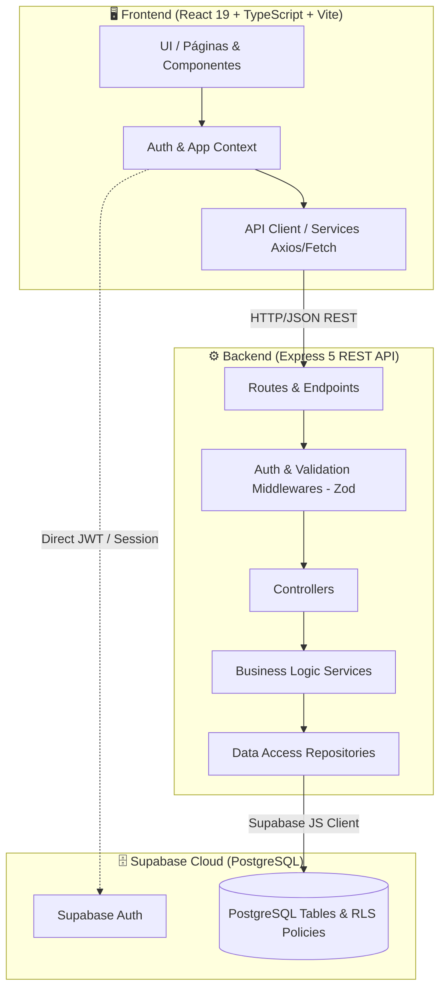

# 🛒 Compra Venta Jáchal & OficiosYa 🛠️

<div align="center">

[](https://react.dev/)
[](https://www.typescriptlang.org/)
[](https://vitejs.dev/)
[](https://tailwindcss.com/)
[](https://nodejs.org/)
[](https://expressjs.com/)
[](https://supabase.com/)
[](https://jestjs.io/)

<p align="center">
  <b>Plataforma digital integral para el comercio local y la contratación de servicios y oficios en el departamento de Jáchal, San Juan.</b>
</p>

[📖 Descripción](#-descripción-del-proyecto) •
[✨ Funcionalidades](#-funcionalidades-principales) •
[🏛️ Arquitectura](#-arquitectura-del-sistema) •
[💻 Stack Tecnológico](#-stack-tecnológico) •
[📁 Estructura](#-estructura-del-repositorio) •
[🎓 Contexto Académico](#-contexto-académico)

---

</div>

## 📖 Descripción del Proyecto

**Compra Venta Jáchal / OficiosYa** es una solución tecnológica web diseñada para conectar a la comunidad jachallera en dos áreas clave:
1. **Mercado de Compra-Venta**: Espacio donde vecinos y comerciantes pueden publicar, descubrir y comerciar productos nuevos o usados de forma simple, directa y segura, integrando contacto directo por WhatsApp.
2. **Red de Oficios y Servicios (OficiosYa)**: Directorio profesional y sistema de intermediación que permite a prestadores de servicios (electricistas, plomeros, albañiles, mecánicos, técnicos, etc.) ofrecer sus servicios, recibir solicitudes de trabajo y construir su reputación con perfiles validados.

Desarrollado con una arquitectura moderna de **monorepo desacoplado** (Frontend SPA + Backend RESTful en capas + Supabase PostgreSQL & Auth).

---

## ✨ Funcionalidades Principales

### 🛍️ Marketplace de Compra-Venta
- 🔍 **Búsqueda & Filtros**: Exploración rápida de productos por categorías, rango de precios, estado y palabras clave.
- 📸 **Publicación Intuitiva**: Creación y edición de publicaciones con subida de imágenes, especificaciones detalladas y precio.
- 💬 **Contacto Inmediato**: Enlace directo a WhatsApp del vendedor con mensaje preformateado sobre el producto de interés.
- 👤 **Panel de Usuario**: Control total sobre publicaciones activas, pausadas o vendidas y perfil del vendedor.

### 🔨 Red de Oficios y Profesionales (OficiosYa)
- 📋 **Catálogo de Servicios**: Organización por rubros y categorías de oficios.
- 👷 **Perfiles de Prestadores**: Información de contacto, zonas de cobertura, tarifas base y experiencia.
- 📝 **Gestión de Solicitudes**: Creación, seguimiento y estados de solicitudes de servicios entre clientes y profesionales.
- 🛡️ **Control de Roles**: Permisos granulares basados en perfiles (`CLIENT`, `PROVIDER`, `ADMIN`).

---

## 🏛️ Arquitectura del Sistema

El sistema implementa el patrón **Arquitectura en Capas (Layered Architecture)** en el backend y una **SPA modular basada en componentes y Context API** en el frontend:



---

## 💻 Stack Tecnológico

### Frontend
- **Framework / Core:** [React 19](https://react.dev/) + [TypeScript](https://www.typescriptlang.org/)
- **Bundler:** [Vite](https://vitejs.dev/)
- **Estilos:** [Tailwind CSS](https://tailwindcss.com/) & CSS Modules
- **Enrutamiento:** [React Router v7](https://reactrouter.com/)
- **Iconografía:** [Lucide React](https://lucide.dev/)

### Backend
- **Entorno de Ejecución:** [Node.js](https://nodejs.org/) (v20+ LTS)
- **Framework Web:** [Express 5](https://expressjs.com/)
- **Validación de Esquemas:** [Zod](https://zod.dev/)
- **Seguridad:** [Helmet](https://helmetjs.github.io/) & [CORS](https://github.com/expressjs/cors)
- **Documentación:** [Swagger UI Express](https://swagger.io/) + `swagger-jsdoc`
- **Testing:** [Jest](https://jestjs.io/) + [Supertest](https://github.com/ladjs/supertest)

### Base de Datos & Autenticación
- **Database:** [PostgreSQL](https://www.postgresql.org/) gestionado en [Supabase](https://supabase.com/)
- **Seguridad de Datos:** Políticas de Row Level Security (RLS)
- **Autenticación:** Supabase Auth con tokens JWT

---

## 📁 Estructura del Repositorio

```text
compra-venta-jachal/
├── backend/                  # API RESTful en Node.js y Express 5
│   ├── src/
│   │   ├── config/           # Configuración de entorno y cliente Supabase
│   │   ├── controllers/      # Controladores HTTP
│   │   ├── middlewares/      # Middlewares de autenticación, roles y validación
│   │   ├── repositories/     # Capa de acceso a datos (Supabase Client)
│   │   ├── routes/           # Rutas y endpoints REST
│   │   ├── services/         # Lógica de negocio
│   │   ├── utils/            # Clases de error y utilidades comunes
│   │   ├── validators/       # Esquemas de validación Zod
│   │   ├── app.js            # Inicialización de la aplicación Express
│   │   └── server.js         # Entrypoint del servidor
│   └── package.json
├── frontend/                 # Aplicación Web React + TypeScript + Vite
│   ├── src/
│   │   ├── assets/           # Imágenes y recursos estáticos
│   │   ├── compra-venta/     # Módulo especializado de Marketplace
│   │   │   ├── components/   # Componentes de Navbar, Cards de producto, etc.
│   │   │   ├── context/      # Contexto de autenticación y estado
│   │   │   ├── layouts/      # Layouts visuales
│   │   │   ├── pages/        # Vistas (Home, Login, Register, Detail, Publish, Profile)
│   │   │   └── services/     # Clientes de API para marketplace
│   │   ├── components/       # Componentes transversales
│   │   ├── pages/            # Vistas principales (Servicios, Categorías, Búsqueda)
│   │   ├── services/         # Clientes de API generales
│   │   └── styles/           # Configuración global de estilos
│   └── package.json
├── supabase/                 # Esquemas y migraciones SQL
│   └── migrations/           # Definición de tablas, roles, RLS y triggers
├── package.json              # Monorepo scripts (orquestación con Concurrently)
└── README.md
```

---

## 🎓 Contexto Académico

Este proyecto fue desarrollado en el marco de la carrera:
* **Carrera:** Tecnicatura Universitaria en Desarrollo de Software (TUDS)
* **Nivel:** 2do Año
* **Localidad:** San José de Jáchal, San Juan, Argentina

---

## 📄 Licencia

Distribuido bajo la Licencia **ISC**.

---

<div align="center">
  <sub>Desarrollado con ❤️ para la comunidad de Jáchal</sub>
</div>
