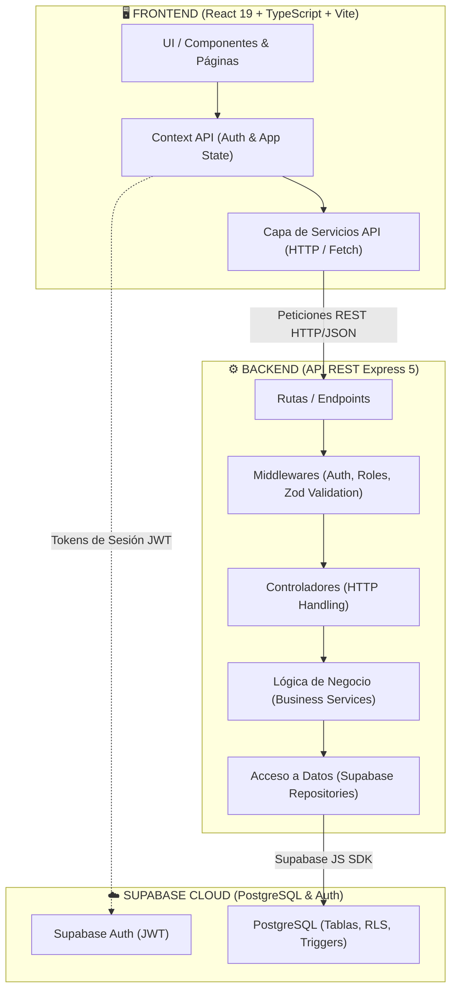
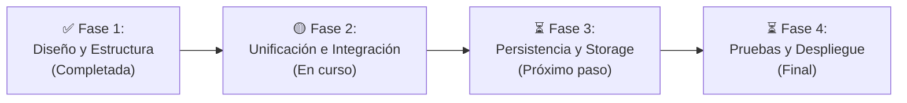

# 📊 Presentación del Proyecto: Compra Venta Jáchal & OficiosYa

> **Plataforma Web Comunitaria de Comercio y Servicios Locales**  
> **Carrera:** Tecnicatura Universitaria en Desarrollo de Software (TUDS - 2do Año)  
> **Ubicación:** San José de Jáchal, San Juan  

---

## 🎯 Diapositiva 1: Introducción y Propósito

### ¿Qué es el proyecto?
**Compra Venta Jáchal & OficiosYa** es una plataforma digital comunitaria integral pensada y diseñada específicamente para el departamento de Jáchal. Unifica en un único ecosistema digital dos soluciones clave:

1. **Marketplace de Compra-Venta:** Espacio para comercializar productos nuevos o usados entre vecinos y comercios locales de forma ágil, transparente y con contacto directo vía WhatsApp (eliminando comisiones intermedias y trabas burocráticas).
2. **OficiosYa (Directorio y Solicitudes de Servicios):** Plataforma profesional para que gasistas, plomeros, electricistas, albañiles, mecánicos, costureras y profesionales independientes ofrezcan sus servicios, reciban solicitudes de presupuesto y construyan una reputación verificada.

### Impacto Social y Local
- Fomento de la economía circular y el comercio de proximidad.
- Formalización y visibilidad del trabajo independiente en la región.
- Solución adaptada a los hábitos locales (comunicación directa y simple).

---

## 🛠️ Diapositiva 2: Stack Tecnológico

El proyecto utiliza tecnologías modernas, estándares de la industria y arquitecturas robustas:

```
┌─────────────────────────────────────────────────────────────┐
│                      STACK TECNOLÓGICO                      │
├──────────────────────────────┬──────────────────────────────┤
│ 🖥️ FRONTEND                  │ ⚙️ BACKEND                    │
│ • React 19 + TypeScript      │ • Node.js (v20+ LTS)         │
│ • Vite 6 / 8 (Bundler rápido)│ • Express 5 (REST API)       │
│ • Tailwind CSS v4 & Modules  │ • Arquitectura en Capas      │
│ • React Router v7            │ • Zod (Validación esquemas)  │
│ • Lucide React (Iconografía) │ • Helmet + CORS (Seguridad)  │
│ • Context API + Fetch Client │ • Jest + Supertest (Testing) │
├──────────────────────────────┴──────────────────────────────┤
│ 🗄️ BASE DE DATOS & AUTENTICACIÓN (SUPABASE CLOUD)            │
│ • PostgreSQL con Extensiones PGCrypto                        │
│ • Row Level Security (RLS) para aislamiento de datos         │
│ • Supabase Auth con Tokens JWT y Roles (CLIENT/PROVIDER/ADMIN)│
└─────────────────────────────────────────────────────────────┘
```

---

## 🏛️ Diapositiva 3: Arquitectura y ¿Por qué Frontend y Backend están Separados?

### Diagrama de Arquitectura (Monorepo Desacoplado)



### ¿Por qué mantener Backend y Frontend separados?

1. **Separación de Responsabilidades (Separation of Concerns):**
   - El **Backend** se enfoca exclusivamente en la integridad de los datos, validaciones de seguridad con Zod, permisos por rol y lógica de negocio.
   - El **Frontend** se enfoca al 100% en la experiencia de usuario (UX), diseño adaptativo (responsive) y rendimiento visual.

2. **Desarrollo Ágil y Paralelo:**
   - Permite avanzar en la interfaz gráfica con datos de prueba (*fallbacks/mocks*) sin depender de que todos los endpoints del servidor estén finalizados en el mismo instante.

3. **Escalabilidad y Despliegue Óptimo:**
   - El frontend se compila como una SPA estática ultrarrápida alojada en CDNs (Vercel, Cloudflare).
   - El backend se aloja en servidores de procesamiento dedicados (Node.js/Render/VPS) consumiendo solo los recursos necesarios.

4. **Multiplataforma (Preparado para el futuro):**
   - Al tener una API REST desacoplada y estandarizada, mañana se puede construir una aplicación móvil (React Native o Flutter) consumiendo exactamente el mismo backend sin tocar una sola línea de lógica del servidor.

5. **Estructura Monorepo:**
   - Aunque están desacoplados funcionalmente, conviven en un mismo repositorio con scripts raíz (`npm run dev`) para que el desarrollador pueda levantar ambos entornos en simultáneo con un solo comando.

---

## 📈 Diapositiva 4: Estado Actual del Proyecto (¿En qué fase estamos?)

Nos encontramos en la **Fase 2 de 4 (Consolidación de Módulos e Integración)**:

| Módulo / Capa | Componente | Estado | Detalle |
| :--- | :--- | :---: | :--- |
| **Backend** | Arquitectura en capas | ✅ **100%** | Routers, Controllers, Services y Repositories implementados. |
| **Backend** | Seguridad y Validación | ✅ **100%** | Zod schemas, Helmet, CORS y control de errores centralizado. |
| **Backend** | Endpoints de OficiosYa | ✅ **100%** | Auth, Categorías, Perfiles, Prestadores, Servicios y Solicitudes. |
| **Backend** | Endpoints de Compra-Venta | 🟡 **30%** | En proceso de migración de esquema de productos a base de datos. |
| **Base de Datos**| Esquema Relacional Supabase | ✅ **85%** | Tablas de perfiles, roles, categorías, servicios y solicitudes con RLS. |
| **Frontend** | Enrutamiento SPA Unificado | ✅ **100%** | Portal OficiosYa (`/`) y Portal Marketplace (`/mercado`) unificados. |
| **Frontend** | Páginas de Marketplace | ✅ **95%** | Catálogo, Vista detalle, Formulario Publicar, Perfil, Login/Registro. |
| **Frontend** | Resiliencia y Fallback | ✅ **100%** | Modo offline/demostración integrado para pruebas fluidas. |

---

## 🚀 Diapositiva 5: ¿Qué es lo que falta? (Roadmap hacia la entrega)



### 1. Persistencia y CRUD de Compra-Venta en Base de Datos (Backend)
- Crear la tabla `products` / `listings` en Supabase con sus políticas RLS.
- Implementar las rutas y controladores correspondientes en el backend (`/api/products`).

### 2. Almacenamiento de Multimedia (Supabase Storage)
- Configurar *buckets* de almacenamiento para imágenes de publicaciones y fotos de perfil de prestadores.
- Subida de archivos desde los formularios del frontend.

### 3. Sistema de Calificaciones y Reseñas (OficiosYa)
- Tablas y endpoints para que los clientes califiquen (1 a 5 estrellas) y dejen opiniones verificadas sobre el trabajo de los profesionales.

### 4. Panel de Administración y Moderación
- Vistas protegidas para rol `ADMIN` que permitan moderar publicaciones, validar nuevos profesionales y gestionar categorías.

### 5. Despliegue a Producción (CI/CD)
- Despliegue del Backend en servicio en la nube (Render / Railway / Supabase Edge).
- Vinculación final de dominios y variables de entorno en producción.

---

## 💡 Diapositiva 6: Resumen Ejecutivo / Conclusión

1. **Impacto Comunitario Real:** Una herramienta hecha a la medida de Jáchal, uniendo comercio minorista y servicios profesionales sin intermediación costosa.
2. **Base Técnica Sólida:** React 19 + TypeScript + Express 5 + Supabase PostgreSQL garantizan robustez, velocidad y seguridad de datos.
3. **Estructura Escalable:** La separación de Frontend y Backend facilita el mantenimiento, testing y la futura expansión a aplicaciones móviles.
4. **Camino Claro:** El proyecto cuenta con una arquitectura unificada, código ordenado y un roadmap definido hacia el lanzamiento final.
